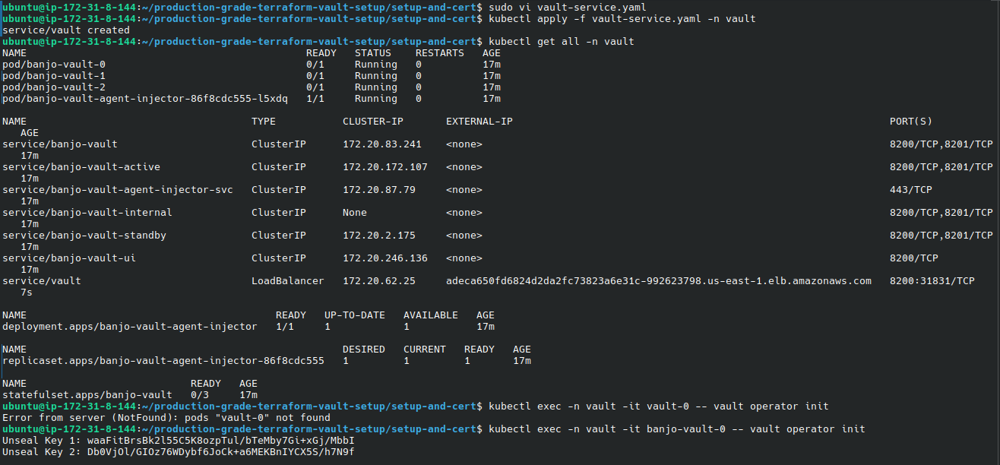
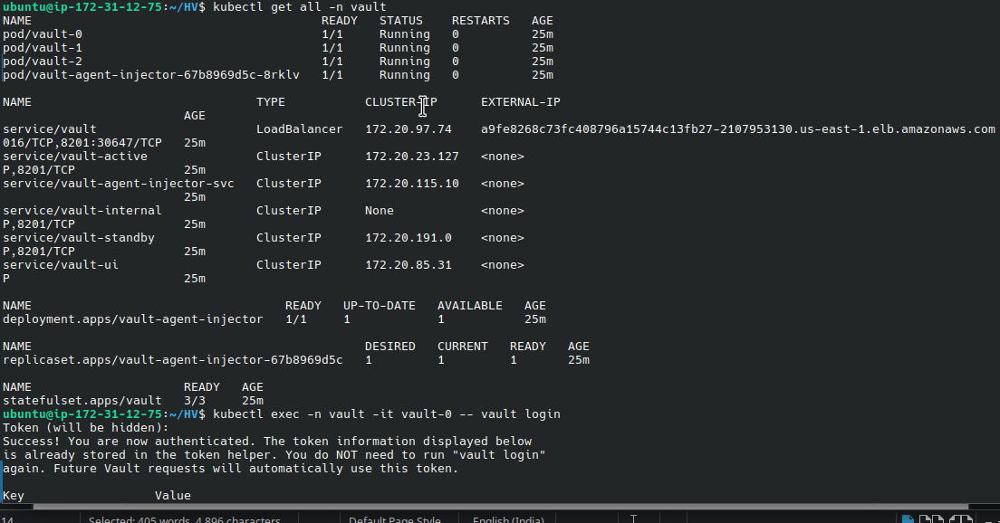
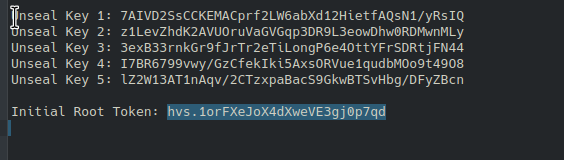
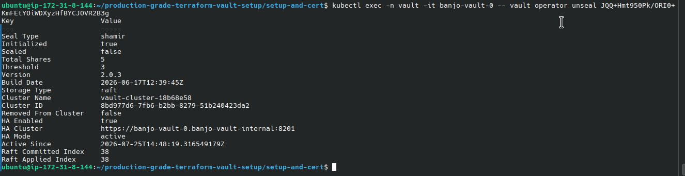
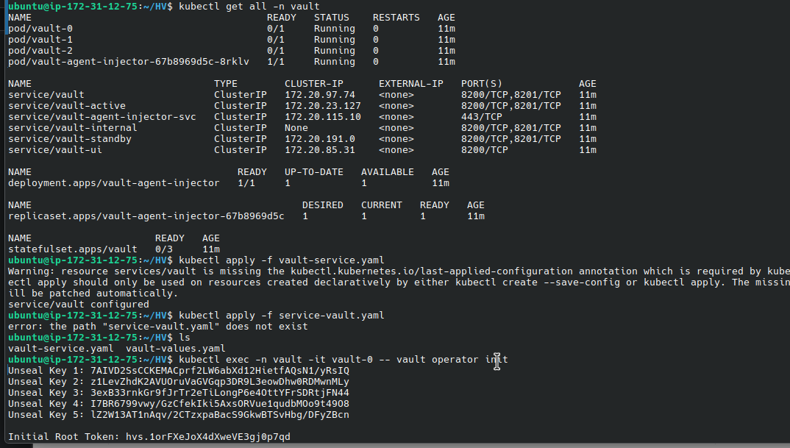
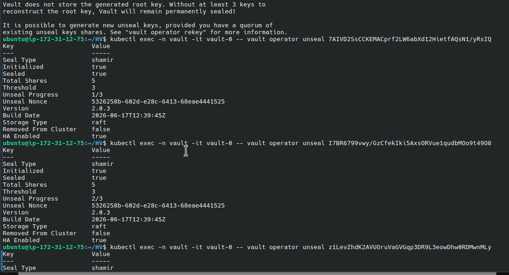
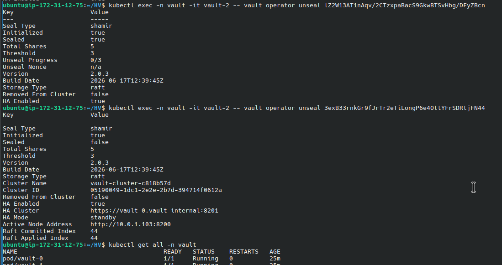
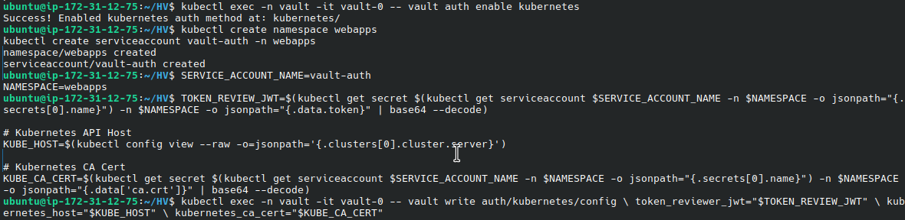

# Production Grade Harshicorp Vault Setup 
Showing the Use of Harshicorp Vaults to handle secrets in kubernetes 

### Set-Up EKS Cluster
***

- [ ] Install AWS CLI
- [ ] Install Terraform
- [ ] Install kubectl
- [ ] Install ekctl and do this `eksctl utils associate-iam-oidc-provider --region us-east-1 --cluster bnj-cluster --approve` because of the version of EKS module 
- [ ] Install Helm
- [ ] Install EKS Using Terraform `terraform init` and `terraform apply –-auto-approve`


`eksctl utils associate-iam-oidc-provider --region us-east-1 --cluster bnj-cluster --approve`

 `aws eks --region us-east-1 update-kubeconfig --name bnj-cluster`

 ```
 eksctl create iamserviceaccount \
  --region us-east-1 \
  --name ebs-csi-controller-sa \
  --namespace kube-system \
  --cluster bnj-cluster \
  --attach-policy-arn arn:aws:iam::aws:policy/service-role/AmazonEBSCSIDriverPolicy \
  --approve \
  --override-existing-serviceaccounts

 ```
Install kubenetes signature for aws_ebs_csi_driver , nginx Ingress, and Cert Manager

 ```
 kubectl apply -k "github.com/kubernetes-sigs/aws-ebs-csi-driver/deploy/kubernetes/overlays/stable/ecr/?ref=release-1.11"

kubectl apply -f https://raw.githubusercontent.com/kubernetes/ingress-nginx/main/deploy/static/provider/cloud/deploy.yaml

kubectl apply -f https://github.com/cert-manager/cert-manager/releases/download/v1.12.0/cert-manager.yaml

 ```

---
### Set Up Hashicorp Vault. Prod Style

- [ ] Create Namespace for Vault to separate Vault’s workloads from the rest of your cluster for organization and RBAC control. Note: the name must be `vault` 

 `kubectl create namespace vault` 

- [ ]  Add Helm Repo and Install Vault with Raft HA
```
 helm repo add hashicorp https://helm.releases.hashicorp.com
 helm repo update

```
 - [ ]  Create `vault-values.yaml` for Production:

 
 
 Image showing that all containers are sealed 

```

server:
  ha:
    enabled: true
    replicas: 3
    raft:
      enabled: true
      config: |
        ui = true

        listener "tcp" {
          address       = "0.0.0.0:8200"
          cluster_address = "0.0.0.0:8201"
          tls_disable   = 1
        }

        storage "raft" {
          path = "/vault/data"

          retry_join {
            leader_api_addr = "http://vault-0.vault-internal:8200"
          }
          retry_join {
            leader_api_addr = "http://vault-1.vault-internal:8200"
          }
          retry_join {
            leader_api_addr = "http://vault-2.vault-internal:8200"
          }
        }

        service_registration "kubernetes" {}

  dataStorage:
    enabled: true
    size: 10Gi
    storageClass: "gp2"  # or "ebs-sc" if you've defined your own

  extraEnvironmentVars:
    VAULT_LOG_LEVEL: "debug"

injector:
  enabled: true

ui:
  enabled: true


```

 - [ ] Install Vault with this config:
`helm install vault hashicorp/vault -n vault -f vault-values.yaml`

 - [ ] Create s Service vailt-service.yaml
 
 ```
apiVersion: v1
kind: Service
metadata:
  name: vault
  namespace: vault
spec:
  type: LoadBalancer
  ports:
    - port: 8200
      targetPort: 8200
  selector:
    app.kubernetes.io/name: vault

 ```
Apply it: `kubectl apply -f vault-service.yaml`



- [ ] Initialize Vault (Run Once)
`kubectl exec -n vault -it vault-0 -- vault operator init` 
Copy and save:
    • 5 unseal keys
    • 1 initial root token
    




- [ ] Unseal Vault on All Pods
Use any 3 keys on each Vault pod:
`kubectl exec -n vault -it vault-0 -- vault operator unseal 7AIVD2SsCCKEMACprf2LW6abXd12HietfAQsN1/yRsIQ`

`kubectl exec -n vault -it vault-1 -- vault operator unseal `

`kubectl exec -n vault -it vault-2 -- vault operator unseal `







- [ ] Login to Vault CLI

`kubectl exec -n vault -it vault-0 -- vault login <Initial Root Token>`

- [ ] Enable Kubernetes Authentication

`kubectl exec -n vault -it vault-0 -- vault auth enable kubernetes`



- [ ] Create Service Account for App Pods

`kubectl create namespace webapps`

`kubectl create serviceaccount vault-auth -n webapps`


